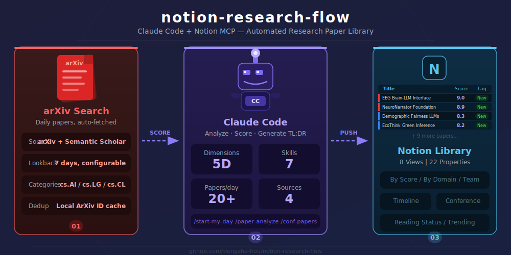

# notion-research-flow

**Claude Code + Notion MCP full-flow research assistant — from daily arXiv to team paper library.**

[](LICENSE)
[](https://docs.anthropic.com/en/docs/claude-code)
[](https://www.notion.com/)
[](https://arxiv.org)
[](https://github.com/dengzhe-hou/notion-research-flow)

> Say `/start-my-day` every morning. Claude searches arXiv, scores papers with 5D signals, and pushes them to your Notion library — fully automated.



<!-- demo gif: record a 30s screen capture of /start-my-day → Notion database populating, then replace this comment -->
<!--  -->

[中文文档](README_CN.md) | [Quick Start](QUICKSTART.md)

---

## Why notion-research-flow?

| Feature | evil-read-arxiv | n8n+Notion | ArxivDigest | **notion-research-flow** |
|---------|----------------|------------|-------------|--------------------------|
| Storage | Obsidian (files) | Notion | Email/GitHub Pages | **Notion** |
| Multi-view filtering | Manual file search | Basic | None | **8 database views** |
| Scoring | 4D | None | GPT rating | **5D (+social signals)** |
| Social signals | None | None | None | **GitHub + Twitter** |
| Team collaboration | None | None | None | **Assign / Comment / Kanban** |
| Setup effort | Manual config | Manual | Manual | **One-command setup** |
| Conference tracking | DBLP | None | None | **DBLP + dedicated views** |
| Weekly digest | None | None | None | **Auto-generated** |

## Features

### Setup & Daily Discovery
- `/setup-workspace` — One-click Notion database + 8 preconfigured views
- `/start-my-day` — Daily arXiv paper discovery with 5D scoring + social signal enrichment
- Automatic deduplication against existing library
- Top-N paper TL;DR generation by Claude

### Multi-Source & Conference Tracking
- `/conf-papers` — Conference paper tracking via Semantic Scholar + DBLP
- 5D scoring: relevance + recency + popularity (citations) + social signals (GitHub stars, Twitter) + quality
- Venue normalization (full conference names → standard abbreviations)

### Deep Analysis & Search
- `/paper-analyze` — Deep paper analysis with PDF extraction (PyMuPDF)
- `/paper-search` — Search across your Notion library by keyword, domain, score, status, or date

### Team Collaboration & Reporting
- `/team-sync` — Assign papers, view assignments, track team reading progress
- `/weekly-digest` — Auto-generated weekly summary with trends, top papers, and domain breakdown

## 5D Scoring Engine

| Dimension | Weight | How it works |
|-----------|--------|-------------|
| Relevance | 35% | Keyword + arXiv category match against your interests |
| Recency | 15% | Exponential decay: exp(-0.1 * days_old) |
| Popularity | 20% | Citation count + venue tier |
| **Social** | **20%** | **GitHub stars + Twitter mentions (new!)** |
| Quality | 10% | Author h-index proxy + abstract quality signals |

## Notion Database Views

Your paper library comes with 8 preconfigured views:

| View | Type | Purpose |
|------|------|---------|
| All Papers | Table | Browse everything, sorted by date |
| By Score | Table | Find the highest-scored papers |
| By Domain | Board | Papers grouped by research area |
| Reading Status | Board | Kanban: Unread / Reading / Read / Noted |
| Conference Tracker | Table | Filter by conference + year |
| Timeline | Calendar | Visualize paper flow over time |
| Trending | Table | Papers with high social signals |
| Team Assignments | Board | Who is reading what |

## Prerequisites

### 1. Install Claude Code

```bash
npm install -g @anthropic-ai/claude-code
claude  # first run will guide you through login
```

### 2. Configure Notion MCP Server

```bash
claude mcp add notion --transport http --url https://mcp.notion.com/mcp
```

Or manually add to `~/.claude/settings.json`:

```json
{
  "mcpServers": {
    "notion": {
      "type": "http",
      "url": "https://mcp.notion.com/mcp"
    }
  }
}
```

The first time you use a Notion tool, Claude Code will open an OAuth authorization page. Grant access and you're set.

### 3. Python 3.9+

```bash
pip install -r requirements.txt
```

## Quick Start

```bash
# 1. Clone and setup
git clone https://github.com/dengzhe-hou/notion-research-flow.git
cd notion-research-flow
./setup.sh    # installs deps, configures MCP, creates config.yaml

# 2. Edit config.yaml with your research interests

# 3. Use in Claude Code
```

Then in Claude Code:

```
/setup-workspace          # Create Notion database (one-time)
/start-my-day             # Fetch today's papers
/paper-analyze 2301.07041 # Deep-read a paper
/conf-papers NeurIPS 2025 # Track conference papers
/paper-search transformer # Search your library
/weekly-digest            # Generate weekly summary
```

## Configuration

Copy `config.example.yaml` to `config.yaml` and customize:

```yaml
interests:
  domains:
    - name: "Large Language Models"
      priority: 8
      keywords: ["LLM", "in-context learning", "RLHF"]
      arxiv_categories: ["cs.CL", "cs.AI"]
    - name: "Vision-Language Models"
      priority: 7
      keywords: ["VLM", "multimodal", "CLIP"]
      arxiv_categories: ["cs.CV", "cs.CL"]

scoring:
  relevance: 35
  recency: 15
  popularity: 20
  social: 20
  quality: 10
```

See [config.example.yaml](config.example.yaml) for all options.

## Automated Daily Runs

Three ways to automate your daily paper intake:

### Option 1: Manual (simplest)
Run `/start-my-day` in Claude Code each morning.

### Option 2: macOS launchd / cron
```bash
# Add to crontab (runs at 8 AM daily)
crontab -e
0 8 * * * cd /path/to/notion-research-flow && claude --print "/start-my-day"
```

### Option 3: Claude Code loop
```
/loop 24h /start-my-day
```

## Troubleshooting

**Notion MCP shows "Needs authentication"**

OAuth tokens expire periodically. To re-authorize:

```bash
claude mcp remove notion
claude mcp add --transport http notion https://mcp.notion.com/mcp
```

Then restart Claude Code and run any Notion command — the browser will prompt for re-authorization.

**Skills not found (e.g., `/start-my-day` not recognized)**

Make sure you're running Claude Code from within the `notion-research-flow` directory. Skills in `.claude/skills/` are only discovered when Claude Code's working directory is the project root.

## FAQ

**Q: Will this affect my existing Notion content?**
A: No. `/setup-workspace` only creates a new, independent page and database. It never modifies or deletes existing content.

**Q: Can I use an existing Notion database?**
A: Yes. Manually edit `.notion-research-flow.json` and set `paper_database_id` to your database ID. Skip `/setup-workspace`.

**Q: Do I need paid APIs?**
A: No. arXiv, Semantic Scholar, and DBLP APIs are all free. Social signals use free web search fallbacks.

**Q: How is this different from evil-read-arxiv?**
A: We use Notion (not Obsidian) as the backend, which enables database views, team collaboration, and a richer filtering experience. We also add social signal scoring (GitHub + Twitter) as a 5th dimension.

**Q: How does this relate to ARIS?**
A: [ARIS](https://github.com/wanshuiyin/Auto-claude-code-research-in-sleep) covers the full research lifecycle (idea → experiment → paper → rebuttal), while notion-research-flow focuses on paper discovery and library management via Notion. They complement each other — use ARIS for research execution and notion-research-flow for organizing your reading.

## Project Structure

```
notion-research-flow/
├── setup.sh                     # One-click setup script
├── config.example.yaml          # Config template (5D scoring, multi-source, team)
├── scripts/                     # Shared utilities
│   ├── config_loader.py         # Config loading & validation
│   ├── notion_helpers.py        # Notion DDL, views, formatting
│   └── fetch_social_signals.py  # GitHub stars + Twitter enrichment
├── .claude/skills/              # Claude Code auto-discovered skills
│   ├── setup-workspace/         # One-click Notion setup
│   ├── start-my-day/            # Daily arXiv discovery + 5D scoring
│   │   └── scripts/             # search_arxiv.py + score_papers.py
│   ├── conf-papers/             # Conference paper tracking
│   │   └── scripts/             # search_semantic_scholar.py + search_dblp.py
│   ├── paper-analyze/           # Deep paper analysis
│   │   └── scripts/             # extract_pdf.py (PyMuPDF)
│   ├── paper-search/            # Notion library search
│   ├── team-sync/               # Team assignment & progress
│   └── weekly-digest/           # Weekly research summary
└── tests/                       # 58 unit tests (scoring, search, extraction)
```

## Contributing

Contributions welcome! Please open an issue or pull request.

## Acknowledgments

Inspired by [evil-read-arxiv](https://github.com/juliye2025/evil-read-arxiv) and [ArxivDigest](https://github.com/AutoLLM/ArxivDigest), which pioneered automated arXiv paper scoring and discovery workflows.

## License

[MIT](LICENSE)
